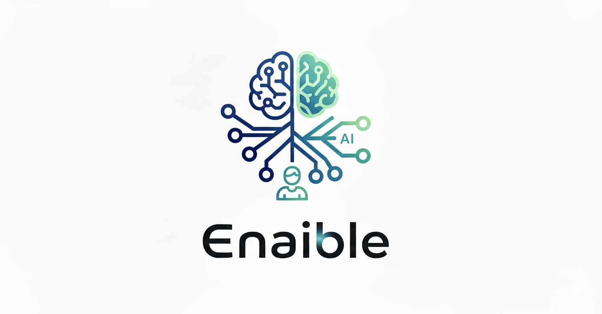

<div align="center">
  

# AI Assisted Workflows

  
  <br/>
  <br/>

  <!-- Status Badges -->


  <!-- Platform & Language Support -->


  <!-- License & Community -->


-32_Specialists-ff6b35?style=flat-square>)
-22_Specialists-ff6b35?style=flat-square>)

</div>

---

## 📋 Table of Contents

- [🎯 Project Overview](#-project-overview)
- [⚡ Quick Start](#-quick-start)
- [💡 Example Use Cases](#-example-use-cases)
  - [🔍 Priming Context](#priming-context)
  - [📝 Session Context Capture](#session-context-capture)
  - [🔬 Technical Research](#technical-research)
  - [⚙️ Feature Planning](#planning-a-feature)
  - [🎨 Product Planning](#planning-a-product-from-scratch)
  - [🏗️ Technical Solutions](#plan-technical-solution)
  - [🔧 Project Setup](#project-setup-including-quality-gates)
  - [📊 Code Quality](#code-quality-analysis)
  - [🔒 Security Analysis](#code-security-analysis)
  - [⚡ Performance](#performance-bottlenecks)
  - [🐛 Debugging](#debugging--root-cause-analysis)
  - [📦 Package Monitoring](#package-monitoring)
  - [⏳ Background Tasks](#background-task-execution)

---

## 🎯 Project Overview

> **Supporting AI Development Workflows with Core Principles**

The principles for this project are designed around the realities of coding with AI. We are approximately **60% complete** on the work needed to fully meet these principles—see the [roadmap](docs/roadmap.md).

<div align="center">

| **Principle**                  |                               **Progress**                               | **Key Features**                                         |
| :----------------------------- | :----------------------------------------------------------------------: | :------------------------------------------------------- |
| 🪶 **Lightweight**             |  | Minimize context impact, JIT loading, external processes |
| 🎯 **Mitigate LLM Weaknesses** |       | Repeatability, predictability, duplication prevention    |
| ⚙️ **Minimize Structure**      |  | Tools over workflows, flexibility over rigidity          |
| 🔄 **LLM Agnostic**            |            | Process independence from specific LLM providers         |
| 💻 **Language Support**        |    | Python, TypeScript, Go, Rust, C#                         |

</div>

---

## ⚡ Quick Start

Install for your preferred AI dev runtime. Details in docs/installation.md

```bash
# Codex CLI (recommended)
./codex/install.sh                   # interactive (choose scope & scripts location)
./codex/install.sh ~                 # user-level (creates ~/.codex/)
./codex/install.sh /my/project/path  # custom (creates <path>/.codex)

# Claude Code
./claude-code/install.sh             # project-local (creates ./.claude/)
./claude-code/install.sh ~           # user-global  (creates ~/.claude/)

# OpenCode
./opencode/install.sh                # project-local (creates ./.opencode/)
./opencode/install.sh ~              # user-global  (creates ~/.config/opencode/)
```

Notes

- Programmatic prompts (analysis, security, performance) require Python 3.11+.
- For Codex, minimal friction comes from placing scripts inside your project (e.g., `./.codex/scripts`) and launching with workspace write. Helpers available in `codex/codex-init-helpers.md`.
- For OpenCode, prefer using the command-executor primary agent for best adherence to shell prompts.

---

## 💡 Example Use Cases

> _Comprehensive workflows demonstrating AI-assisted development_

<details>
<summary><strong>View All Use Cases</strong></summary>

### 🔍 Priming context

<div align="right"><a href="#-table-of-contents">↑ back to top</a></div>

**Use case**: Coming in fresh to a new codebase or starting a new session requires systematic context gathering across documentation, architecture, and recent changes to avoid manual exploration and inconsistent understanding.

**Task Actions**:

- **Orchestrates parallel analysis** across documentation, structure, tech stack, commands, and git history
- **Correlates findings** from multiple sources (README, package.json, git commits) for comprehensive understanding
- **Generates standardized primer** with templated format for consistent project overviews
- **Understands recent changes** from recent commits to understand current development
- **Parallel Task agents** analyze purpose, tech stack, architecture, commands, testing in concurrent workflows
- **MCP Serena LSP symbol search** - Language Server Protocol integration for semantic codebase analysis
- **Git history analysis** extracts last 3 commits for objective, files changed, and implementation patterns
- **Multi-source scanning** of key files (README, CLAUDE.md, package.json, Makefile, etc.)

**Benefits**:

- Works across any project structure or language
- Same analysis approach produces consistent primers
- Combines automated scanning with contextual interpretation
- Fast onboarding with comprehensive coverage (structure + patterns + recent changes)

**Available via:** Claude Code `/get-primer`, OpenCode `/get-primer`, Codex `/get-primer`.

**Common workflow**:

```bash
# 📋 Generate comprehensive project primer
/get-primer
```

---

### 📝 Session context capture

<div align="right"><a href="#-table-of-contents">↑ back to top</a></div>

**Use case**: Development sessions involve multiple decisions, actions, and context that gets lost between sessions, leading to repeated investigations and lost continuity across sessions.

**Task Actions**:

- **Multi-platform session tracking** with dedicated capture scripts for Claude Code, OpenCode, and Codex, reading directly from each tool's session storage
- **Claude Code integration** accessing session data from `~/.claude/projects/` JSONL files with comprehensive operation extraction
- **OpenCode integration** accessing session data from `~/.local/share/opencode/storage/` with message and part file parsing
- **Codex integration** accessing session data from `~/.codex/sessions/` JSONL archives with shared parsing utilities
- **Intelligent exclusion system** filtering sensitive data, duplicate operations, and noise patterns through configurable exclusion rules
- **Automatic redaction** detecting and masking API keys, passwords, tokens, and other sensitive data in captured context
- **Recent activity analysis** reviewing captured operations and git history to understand current development focus
- **Multi-method search capabilities** including UUID filtering, semantic search, and pattern matching across session content
- **Cross-session continuity** maintaining session context through UUID persistence and comprehensive operation tracking

**Search Methods**:

- **UUID filtering** (`--uuid`) - Target specific sessions by their unique identifier for focused analysis
- **Semantic search** (`--search-term`) - Find sessions containing semantically matching content with intelligent pattern recognition
- **Semantic variations** - Enhanced search with context-aware variations including synonyms, verb forms, and related technical concepts
- **Time-based filtering** (`--days`) - Limit analysis to recent sessions within configurable time windows
- **Verbose expansion** (`--verbose`) - Expand truncated content for detailed investigation of specific sessions

- Prevents repeated investigation by maintaining searchable action history across Claude Code, OpenCode, and Codex platforms
- Enables quick orientation on recent work through automated activity summaries with flexible search capabilities
- **Security-first design** with automatic redaction of sensitive data and configurable exclusion patterns
- Creates objective record of development actions beyond git commits with direct session file system access
- Maintains workflow context across extended development periods and team handoffs
- **Noise reduction** through intelligent filtering of duplicate operations and irrelevant system files
- Provides data-driven insights into development patterns and productivity with multi-platform support

**Available via:** Claude Code `/get-recent-context`, OpenCode `/get-recent-context`, Codex `/get-recent-context`.

**Common workflow**:

```bash
# 📊 Review recent activity for quick orientation (default: last 2 days)
/get-recent-context

# 🔍 Search for sessions with semantic matching
/get-recent-context --search-term "authentication bug"

# 🎯 Analyze specific session by UUID
/get-recent-context --uuid a1b2c3d4-e5f6-7890-abcd-ef1234567890

# 📝 Get detailed analysis with full conversation content
/get-recent-context --verbose

# 🔎 Combined search within specific session
/get-recent-context --uuid a1b2c3d4-e5f6-7890-abcd-ef1234567890 --search-term "refactor"
```

---

### 🔬 Technical research

<div align="right"><a href="#-table-of-contents">↑ back to top</a></div>

**Use case**: Complex technical investigations require systematic research across documentation, code repositories, academic sources, and current implementations to make informed decisions without bias toward familiar solutions.

**Task Actions**:

- **Research strategy coordination** planning investigation across multiple sources and specialist researchers
- **Information synthesis** correlating findings from documentation, code analysis, and implementation examples
- **Bias mitigation** ensuring comprehensive coverage beyond familiar technologies and approaches
- **Evidence-based recommendations** weighing technical trade-offs with supporting research and examples
- **@agent-research-coordinator** strategically plans and allocates research tasks across specialist researchers
- **@agent-technical-researcher** analyzes code repositories, GitHub projects, and implementation details
- **@agent-docs-scraper** extracts and processes technical documentation from various sources
- **Coordinate scrape and fetch** docs scraper agent uses external tools to gather identified information to minimise context impact

**Benefits**:

- Systematic approach prevents research blind spots and confirmation bias
- Specialist agents provide deep expertise in their respective domains
- Comprehensive coverage across documentation, implementations, and academic sources
- Evidence-based decision making with supporting research and examples

**Common workflow**:

```bash
# 🔬 Coordinate comprehensive technical research
# Multi-agent orchestration:
#   • @agent-research-coordinator: Investigation strategy
#   • @agent-technical-researcher: Implementation analysis
#   • @agent-docs-scraper: Documentation processing

# Example: Research agentic RAG best practices
@agent-research-coordinator "research best practices for implementing Agentic RAG, including recent innovations"
```

---

### ⚙️ Planning a feature

<div align="right"><a href="#-table-of-contents">↑ back to top</a></div>

**Use case**: Feature development requires balancing user needs, technical constraints, and existing architecture to deliver valuable functionality without compromising system maintainability or introducing technical debt.

**Task Actions**:

- **Requirements analysis** translating user needs into technical specifications with clear acceptance criteria
- **Architecture integration planning** ensuring new features align with existing system design and patterns
- **Implementation strategy development** breaking complex features into manageable, testable components
- **Risk assessment and mitigation** identifying potential issues early and planning preventive measures
- **Technical feasibility validation** analyzing existing codebase constraints and integration points
- **User story template generation** standardizing feature requirements with consistent format and criteria
- **Implementation task breakdown** creating actionable development tasks with dependencies and estimates
- **Quality gate integration** ensuring testing, security, and performance considerations from planning phase

**Benefits**:

- Systematic approach prevents feature creep and scope misalignment
- Early technical validation reduces implementation risks and rework
- Consistent planning format enables better estimation and team coordination
- Quality considerations integrated from planning prevent post-development issues

**Available via:** Claude Code `/plan-solution`, OpenCode `/plan-solution`, Codex `/plan-solution` and `/plan-refactor`.

**Common workflow**:

```bash
# ⚙️ Feature planning with technical validation

# 1. Analyze requirements and constraints while validating the approach
/plan-solution "user authentication with OAuth2" --critique

# 2. Outline supporting refactors or migrations
/plan-refactor "align legacy auth flows with OAuth2 rollout"
```

---

### 🎨 Planning a product from scratch

<div align="right"><a href="#-table-of-contents">↑ back to top</a></div>

**Use case**: New product development requires market research, user needs analysis, and competitive positioning to create products that solve real problems while avoiding feature bloat and market misalignment.

**Task Actions**:

- **Product Requirements Document generation** structuring vision, objectives, target users, and success metrics systematically
- **Feature prioritization framework** balancing user value, technical complexity, and competitive differentiation
- **User experience planning** designing workflows and interactions based on user research insights
- **Go-to-market strategy integration** aligning product features with market positioning and business objectives
- **Competitive intelligence agent** analyzes existing solutions, pricing models, and market gaps
- **User research agent** validates assumptions through market analysis and user behavior patterns
- **Multi-agent validation** ensures technical feasibility aligns with market requirements
- **PRD template standardization** maintains consistency across product planning initiatives

**Benefits**:

- Market-informed product decisions reduce launch risks and feature misalignment
- Systematic user research prevents building products nobody wants
- Competitive analysis identifies differentiation opportunities and market gaps
- Structured PRD process ensures all stakeholders align on product vision
- More UX focused than standard PRD, aims to make it focused at LLM's as opposed to PM's

**Available via:** Claude Code `/plan-ux-prd`, OpenCode `/plan-ux-prd`, Codex `/plan-ux-prd`.

**Common workflow**:

```bash
# Product planning with market validation
/plan-ux-prd "AI-powered code review tool for enterprise teams"

# validate with @agent-competitive-intelligence-analyst
# validate with @agent-user-researcher

# Expected output: Comprehensive PRD with market analysis, user research insights,
# competitive positioning, feature priorities, and go-to-market strategy
```

---

### 🏗️ Plan technical solution

<div align="right"><a href="#-table-of-contents">↑ back to top</a></div>

**Use case**: Complex technical implementations require structured planning with risk assessment, architectural considerations, and validation to avoid over-engineering while ensuring scalable, maintainable solutions.

**Task Actions**:

- **Architecture design guidance** balancing complexity, maintainability, and performance requirements
- **Risk assessment integration** identifying technical risks, scalability concerns, and mitigation strategies
- **Implementation roadmap generation** with milestones, dependencies, and validation checkpoints
- **Solution validator agent review** provides senior-level technical feedback with `--critique` (using reasoning through perspective)
- **Clarifying questions methodology** gathering requirements, constraints, scale, and success criteria systematically
- **Prototype mode support** enables rapid validation of core concepts before full implementation
- **Implementation plan documentation** captures decisions, rationale, and next steps for team alignment

**Benefits**:

- Structured approach prevents over-engineering and scope creep
- Senior-level validation catches architectural issues early
- Clear implementation roadmap enables team coordination and progress tracking
- Systematic risk assessment reduces project failures

**Available via:** Claude Code `/plan-solution`, OpenCode `/plan-solution`, Codex `/plan-solution`.

**Common workflow**:

```bash
# Structured technical solution planning
/plan-solution "implement real-time collaboration features with conflict resolution" --critique

# [System asks clarifying questions about scale, requirements, constraints]

# Senior technical validation
# validate the plan with @agent-solution-validator

# Multi-agent implementation orchestration (Claude Code • OpenCode today)
/todo-build implementation-plan.md --prototype

# Expected output: Validated technical plan, risk assessment,
# implementation roadmap, and agent orchestration workflow
```

---

### 🔧 Project setup including quality gates

<div align="right"><a href="#-table-of-contents">↑ back to top</a></div>

**Use case**: New projects require consistent setup of testing frameworks, CI pipelines, quality gates, and monitoring to prevent technical debt accumulation and ensure maintainable development workflows from project inception.

**Task Actions**:

- **Requirements analysis** from todos/markdown files to understand project scope and infrastructure needs
- **Technology-specific configuration** adapting quality gates to detected languages and frameworks
- **Monitoring strategy planning** based on project type (API, frontend, full-stack) and expected scale
- **Integration coordination** ensuring CI, monitoring, and quality tools work together seamlessly
- **Standardized configurations** leverages [better-t-stack](https://better-t-stack.dev/) applied across projects: pre-commit hooks, CI workflows, linting rules
- **Automated dependency setup** installs and configures testing frameworks, quality analyzers, monitoring tools
- **MCP Serena integration** provides enhanced LSP-based codebase search capabilities
- **Quality gate enforcement** via pre-commit, CI/CD, and automated analysis tool integration

**Benefits**:

- Consistent development environment across all projects
- Quality enforcement from first commit prevents technical debt accumulation
- Automated setup reduces configuration errors and saves setup time
- Monitoring and analysis tools integrated from project start

**Available via:** Claude Code `/create-project`, OpenCode `/create-project`, Codex `/create-project` (with `/setup-dev-monitoring`, `/add-code-precommit-checks`, `/setup-serena-mcp` available across all three).

**Common workflow**:

```bash
# Create new project with requirements-driven setup
/create-project inventory-api --from-todos project-requirements.md

# Add development monitoring and quality gates
/setup-dev-monitoring
/add-code-precommit-checks

# Enable enhanced codebase search capabilities
/setup-serena-mcp
```

---

### 📊 Code quality analysis

<div align="right"><a href="#-table-of-contents">↑ back to top</a></div>

**Use case**: Code quality assessment requires measurable metrics and systematic evaluation to identify technical debt, maintainability issues, and refactoring opportunities before they impact development velocity.

**Task Actions**:

- **Quality metrics interpretation** analyzing complexity, maintainability, and architectural compliance in business context
- **Technical debt prioritization** ranking improvement opportunities by impact and implementation effort
- **Best practices compliance evaluation** comparing code patterns against SOLID principles and design standards
- **Improvement roadmap generation** with specific recommendations and refactoring strategies
- **Lizard complexity analyzer** provides cyclomatic complexity, function length, and parameter count analysis
- **Code duplication detection (jscpd)** identifies repeated patterns and refactoring candidates
- **Coverage analysis integration** assesses test quality and testability
- **Pattern classification** detects anti-patterns and design pattern compliance

**Benefits**:

- Measurable quality metrics enable objective improvement tracking
- Systematic evaluation identifies technical debt before it impacts velocity
- Works across multiple programming languages with consistent analysis
- Prioritized recommendations focus efforts on high-impact improvements

**Available via:** Claude Code `/analyze-code-quality`, OpenCode `/analyze-code-quality`, Codex `/analyze-code-quality`.

**Common workflow**:

```bash
# Comprehensive quality analysis of codebase
/analyze-code-quality src/

# Expected output: Complexity metrics, technical debt assessment,
# best practices compliance, and prioritized improvement recommendations
```

---

### 🔒 Code security analysis

<div align="right"><a href="#-table-of-contents">↑ back to top</a></div>

**Use case**: Security vulnerability assessment requires comprehensive OWASP Top 10 coverage combined with contextual threat analysis to identify real security risks while minimizing false positives in complex applications.

```bash
/analyze-security src/ --verbose
```

**Task Actions**:

- **Three-phase systematic approach** with user confirmations: automated assessment → gap analysis → risk prioritization
- **OWASP Top 10 framework integration** contextualizing automated findings against standard security categories
- **Technology-specific threat assessment** analyzing framework-specific protections (Django CSRF, React XSS, Express headers)
- **Risk correlation and prioritization** combining automated findings with business context for actionable recommendations
- **Semgrep semantic analysis** detects OWASP Top 10 vulnerabilities: injection (A01), XSS (A03), authentication failures (A07)
- **Detect-secrets entropy analysis** finds hardcoded credentials and API keys using advanced pattern matching
- **Framework-specific configuration validation** checks security settings for detected technology stacks
- **Multi-phase execution** with quality gates ensuring thorough coverage without overwhelming output

**Benefits**:

- Comprehensive OWASP coverage reduces security blind spots
- False positive reduction through contextual analysis and semantic understanding
- Framework-aware assessment provides technology-specific recommendations
- Systematic approach prevents security debt accumulation

**Available via:** Claude Code `/analyze-security`, OpenCode `/analyze-security`, Codex `/analyze-security`.

**Common workflow**:

```bash
# Comprehensive security analysis with detailed output
/analyze-security . --verbose

# Three-phase process:
# Phase 1: Automated scanning (semgrep + detect-secrets)
# Phase 2: Gap assessment and framework-specific analysis
# Phase 3: Risk prioritization and actionable recommendations
```

---

### ⚡ Performance bottlenecks

<div align="right"><a href="#-table-of-contents">↑ back to top</a></div>

**Use case**: Performance optimization requires systematic identification of bottlenecks across database queries, frontend rendering, algorithm complexity, and network requests to prioritize improvements by user impact and implementation effort.

```bash
/analyze-performance src/
```

**Task Actions**:

- **Multi-layer performance analysis** correlating findings across database, frontend, and algorithm performance
- **Bottleneck prioritization** ranking optimizations by user experience impact and implementation complexity
- **Optimization strategy recommendations** with before/after validation approaches and performance benchmarks
- **User experience context** connecting technical metrics to business impact and user satisfaction
- **Ruff analyzer** detects Python performance anti-patterns and inefficient code constructs
- **Frontend performance analysis** examines bundle size, render optimization, and memory leak patterns
- **SQLGlot analyzer** identifies database query optimization opportunities and N+1 problems
- **Semgrep heuristics (optional)** provide multi-language performance best‑practice checks
- **Algorithm complexity assessment** profiles CPU/memory usage and identifies optimization candidates

**Benefits**:

- Multi-layer analysis catches performance issues across the full stack
- Measurable metrics enable objective optimization tracking and validation
- Prioritized recommendations focus efforts on high-impact improvements
- Works across backend, frontend, and database performance domains

**Available via:** Claude Code `/analyze-performance`, OpenCode `/analyze-performance`, Codex `/analyze-performance`.

**Common workflow**:

```bash
# Comprehensive performance analysis across all layers
/analyze-performance .

# Expected output: Database optimization opportunities, frontend performance metrics,
# algorithm complexity analysis, and prioritized optimization recommendations
```

---

### 🐛 Debugging & Root Cause Analysis

<div align="right"><a href="#-table-of-contents">↑ back to top</a></div>

**Use case**: API timeouts, production crashes, and intermittent failures require systematic investigation across code changes, execution patterns, and known error signatures. Traditional debugging relies on developer intuition and manual log analysis, leading to inconsistent results and missed root causes.

```bash
/analyze-root-cause "API timeouts on /users endpoint after deployment" [--verbose]
```

**Task Actions**:

- **Interprets standardized JSON results** from three analyzers with consistent structure for reliable parsing
- **Applies contextual reasoning** to correlate findings across execution patterns, recent changes, and error signatures
- **Generates investigation priorities** based on error context and timing analysis
- **Provides human-readable explanations** while maintaining evidence-based recommendations
- **Verbose flag enables comprehensive diagnostic output** including distributed tracing setup and detailed error context
- **`root_cause:trace_execution`** - Analyzes execution patterns with **error-context targeting** (requires specific error info for focused investigation)
  - Parses error messages to extract file/line context using **language-agnostic regex patterns**
  - Identifies missing error handling around failure points with **consistent pattern matching**
- **`root_cause:recent_changes`** - Git history analysis for **risky change correlation** over configurable timeframes (default: 30 days, 100 commits)
  - **Pattern-based detection** of hotfixes, rollbacks, and emergency commits for **repeatable results**
  - **Timing analysis** identifies weekend/late-night commits indicating emergency responses
  - **Change category classification**: authentication, database, API, configuration, dependencies, critical files
- **`root_cause:error_patterns`** - **Known error pattern detection** across 9 categories for **systematic investigation**
  - **Multi-language pattern matching**: memory leaks, null pointers, race conditions, injection vulnerabilities
  - **Contextual pattern analysis** reduces false positives through refined regex patterns
  - **Error clustering analysis** identifies systemic issues across codebase

**Benefits**:

- Works across all project supported languages
- Same error input produces consistent pattern analysis across runs
- Looks for process failures not just bugs
- ensures comprehensive investigation (code patterns + change history + execution analysis)

**Available via:** Claude Code `/analyze-root-cause`, OpenCode `/analyze-root-cause`, Codex `/analyze-root-cause`.

**Common workflow**:

```bash
# Quick root cause analysis with standard output
/analyze-root-cause "API timeouts on /users endpoint"

# Comprehensive investigation with detailed diagnostics
/analyze-root-cause "Database connection pool exhausted during peak traffic" --verbose

# Focus on specific error with structured investigation
/analyze-root-cause "TypeError: Cannot read property 'id' of undefined at UserService.js:42"

```

---

### 📦 Package monitoring

<div align="right"><a href="#-table-of-contents">↑ back to top</a></div>

**Use case**: Dependency vulnerabilities and outdated packages require continuous monitoring to prevent security breaches and compatibility issues, but manual tracking across multiple language ecosystems becomes unmanageable as projects scale.

```bash
/setup-package-monitoring --audit-level=critical
```

**Task Actions**:

- **Dual-layer security approach** combining immediate commit-time auditing with ongoing vulnerability monitoring
- **Path-triggered CI auditing** runs critical vulnerability checks only when package files change, preventing vulnerable dependencies from entering codebase
- **Dependabot automation** provides continuous background monitoring with automated update PRs for all detected ecosystems
- **Multi-language ecosystem detection** automatically identifies Python, JavaScript, Go, Rust, and .NET package files across project
- **Critical-only vulnerability blocking** at commit time focuses on high-impact security issues while Dependabot handles routine maintenance
- **Smart CI optimization** through path-based triggers that activate only on relevant file changes, avoiding unnecessary resource usage
- **Enterprise-grade configuration** with optional branch protection enforcement and configurable audit severity levels
- **Efficient search capabilities** with --package-file for direct specification and --exclude for skipping large directories

**Benefits**:

- **Immediate protection**: Commit-time auditing blocks critical vulnerabilities before they reach main branch
- **Ongoing monitoring**: Dependabot provides continuous surveillance and automated updates for emerging threats
- **No duplication**: Complementary approach reduces noise while ensuring comprehensive coverage
- **Multi-ecosystem support**: Handles polyglot projects with unified configuration across Python, JavaScript, Go, Rust, .NET
- **Cost-efficient CI**: Path-triggered workflows minimize CI costs by running only when dependencies actually change
- **Zero maintenance**: Automated setup and configuration requires no ongoing developer intervention

**Available via:** Claude Code `/setup-package-monitoring`, OpenCode `/setup-package-monitoring`, Codex `/setup-package-monitoring`.

**Common workflow**:

```bash
# Quick setup with automatic detection and critical-only blocking
/setup-package-monitoring

# Efficient setup for large monorepos with targeted monitoring
/setup-package-monitoring --package-file=package.json --exclude=node_modules

# Enterprise setup with branch protection and moderate sensitivity
/setup-package-monitoring --audit-level=moderate --branch-protection=true

# Expected output: Dependabot config for all ecosystems, path-triggered
# audit workflow, and comprehensive security policy documentation
```

---

### ⏳ Background task execution

<div align="right"><a href="#-table-of-contents">↑ back to top</a></div>

**Use case**: Long-running development tasks like comprehensive refactoring, extensive documentation generation, or complex analysis require autonomous execution without blocking current work sessions, while maintaining progress tracking and result documentation.

**Task Actions**:

- **Autonomous task execution** running complex development workflows independently in background processes
- **Progress documentation** automatically capturing decisions, discoveries, and implementation steps throughout execution
- **Multi-CLI orchestration** coordinating tasks across Claude Code, Qwen, and Gemini based on task requirements and resource availability
- **Continuous reporting** maintaining detailed logs and results in structured markdown reports for later review
- **Background process management** launching AI CLI instances with appropriate automation flags for unattended operation
- **Report file generation** creating timestamped documentation with task context, progress updates, and final outcomes
- **CLI-specific optimization** using Claude Code for complex reasoning, Qwen/Gemini for cost-effective long-running tasks
- **Process monitoring** enabling progress tracking and output capture for running background tasks

**Benefits**:

- **Non-blocking execution** allows continued development while complex tasks run autonomously in background
- **Resource optimization** leverages free capacity of Qwen and Gemini CLIs for cost-effective long-running operations
- **Comprehensive documentation** ensures no work is lost with detailed progress tracking and decision capture
- **Flexible model selection** enables choosing appropriate AI capability (Claude Opus for complex reasoning, alternatives for routine tasks)
- **Parallel development** supports multiple concurrent background tasks while maintaining primary development flow

**Common workflow**:

```bash
# Complex refactoring with detailed documentation using Claude Opus
/todo-background "Refactor authentication module to use OAuth 2.0" claude:opus ./reports/auth-refactor.md

# Cost-effective documentation generation using Qwen
/todo-background "Generate comprehensive API documentation for all endpoints" qwen

# Long-running analysis using Gemini with auto-generated report
/todo-background "Analyze codebase for performance optimization opportunities" gemini

# Expected output: Background process running autonomously with progress
# reports saved to specified files for later review and integration
```

### 🤝 How do you want to work?

These examples give a flavour, explore the repo and find what works for you.

</details>

---

## 📚 Documentation Map

- Install & setup: docs/installation.md
- Analyzer scripts overview: docs/analysis-scripts.md
- Monitoring & logs: docs/monitoring.md
- Agent orchestration: docs/subagents.md
- Roadmap: docs/roadmap.md
- Codex references (official excerpts mirrored in-repo):
  - codex/docs/config.md
  - codex/docs/prompts.md
  - codex/docs/sandbox.md
  - codex/docs/threads.md

---

## 📚 Quick Start & Detailed Documentation

<div align="right"><a href="#-table-of-contents">↑ back to top</a></div>

<div align="center">

|   **Category**    | **Document**                                    | **Description**                                          |
| :---------------: | :---------------------------------------------- | :------------------------------------------------------- |
|   🚀 **Setup**    | [Installation Guide](docs/installation.md)      | Complete setup and configuration instructions            |
|   🤖 **Agents**   | [Agent Orchestration](docs/subagents.md)        | Claude/OpenCode agent catalog and orchestration guidance |
|  ⚙️ **Commands**  | [Commands & Analysis](docs/analysis-scripts.md) | 20 analyzers across five quality categories              |
| ⚙️ **Monitoring** | [Dev Monitoring](docs/monitoring.md)            | Live Monitoring of hot swappable components              |

---

[](LICENSE)

[Report Issues](https://github.com/adam-versed/ai-assisted-workflows/issues) • [Request Features](https://github.com/adam-versed/ai-assisted-workflows/discussions)

</div>
