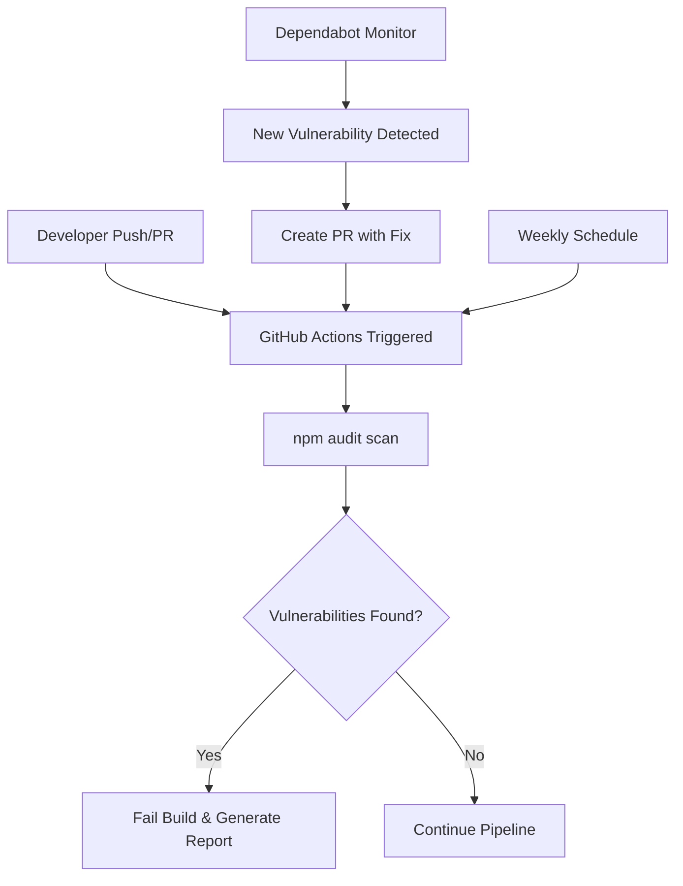

# NPM Security Automation Guide

## Research Findings & Implementation Plan

---

## Executive Summary

This document outlines a comprehensive security automation strategy for npm-based projects using GitHub Actions. After analyzing the current compromised package scanning script and researching industry best practices, I recommend leveraging established, free tools (GitHub Dependabot + native npm audit) rather than maintaining bespoke security scanning code.

---

## 1. Current State Analysis

### Existing Script Review

The provided bash script scans for 6 specific compromised packages:

- debug@4.4.2
- chalk@5.6.1
- supports-hyperlinks@4.1.1
- chalk-template@1.1.1
- slice-ansi@7.1.1
- wrap-ansi@9.0.1

**Strengths:**

- Read-only, safe operation
- Clear reporting with color coding
- Scans both direct and transitive dependencies
- Works across multiple projects

**Limitations:**

- Only checks for 6 specific packages
- Requires manual updates for new vulnerabilities
- No automated remediation
- Doesn't integrate with CI/CD pipeline
- macOS bash compatibility issues (v3.2)

---

## 2. Research Findings

### How npm audit Works

npm audit provides built-in vulnerability scanning by:

1. Analyzing your project's dependency tree from package-lock.json
2. Submitting dependency information to the GitHub Advisory Database
3. Returning vulnerability reports with:
   - CVE identifiers
   - Severity ratings (info, low, moderate, high, critical)
   - Affected version ranges
   - Remediation recommendations
   - Available patches

### Available Security Solutions Comparison

| Solution               | Cost     | Pros                                                                               | Cons                                                                  | Best For                |
| ---------------------- | -------- | ---------------------------------------------------------------------------------- | --------------------------------------------------------------------- | ----------------------- |
| **GitHub Dependabot**  | Free     | • Zero setup<br>• Auto PRs<br>• Multi-language<br>• Native GitHub integration      | • Update-only focus<br>• Limited customization<br>• No license checks | All projects (baseline) |
| **npm audit (native)** | Free     | • Built into npm<br>• Fast execution<br>• No dependencies<br>• JSON output         | • Basic reporting<br>• Manual fixes<br>• False positives              | CI/CD validation        |
| **IBM audit-ci**       | Free     | • CI-optimized<br>• Whitelist support<br>• Multi-package manager<br>• Configurable | • CLI only<br>• No auto-fix<br>• Manual setup                         | Medium teams            |
| **Snyk**               | Freemium | • Comprehensive DB<br>• Code scanning<br>• License compliance<br>• Advanced fixes  | • Limited free tier<br>• Expensive scaling<br>• External dependency   | Enterprise              |
| **Socket Security**    | Freemium | • Supply chain focus<br>• Behavior analysis<br>• Real-time monitoring              | • New platform<br>• Limited free tier                                 | High-security apps      |

### Industry Best Practices

1. **Defense in Depth**: Use multiple scanning layers
2. **Shift Left**: Scan early and often in development
3. **Automate Everything**: Remove manual security checks
4. **Fail Fast**: Block deployments with vulnerabilities
5. **Regular Updates**: Weekly minimum for security patches

---

## 3. Proposed Solution Architecture

### Recommended Stack: Dependabot + npm audit + GitHub Actions



### Why This Approach?

1. **Comprehensive Coverage**: Combines continuous monitoring (Dependabot) with validation gates (npm audit)
2. **Zero Cost**: Entirely free for all repositories
3. **Low Maintenance**: Uses tools maintained by GitHub/npm
4. **Industry Standard**: Follows security best practices
5. **Scalable**: Works for single repo or organization-wide

---

## 4. Implementation Plan

### Phase 1: Dependabot Configuration

**File:** `.github/dependabot.yml`

```yaml
version: 2
updates:
  # NPM dependencies
  - package-ecosystem: "npm"
    directory: "/"
    schedule:
      interval: "weekly"
      day: "monday"
      time: "04:00"
    open-pull-requests-limit: 10
    groups:
      # Group all non-security updates
      dependencies:
        dependency-type: "production"
        update-types:
          - "minor"
          - "patch"
    # Separate security updates for immediate attention
    labels:
      - "dependencies"
      - "security"
    commit-message:
      prefix: "npm"
      prefix-development: "npm-dev"
      include: "scope"
```

### Phase 2: GitHub Actions Workflow

**File:** `.github/workflows/npm-security.yml`

```yaml
name: NPM Security Audit

on:
  push:
    branches: [main, develop]
  pull_request:
    branches: [main]
  schedule:
    # Weekly scan on Monday at 9 AM UTC
    - cron: "0 9 * * 1"
  workflow_dispatch: # Manual trigger

jobs:
  security-audit:
    runs-on: ubuntu-latest
    strategy:
      matrix:
        node-version: [18.x, 20.x]

    steps:
      - name: Checkout code
        uses: actions/checkout@v4

      - name: Setup Node.js
        uses: actions/setup-node@v4
        with:
          node-version: ${{ matrix.node-version }}
          cache: "npm"

      - name: Install dependencies
        run: npm ci --ignore-scripts

      - name: Run npm audit
        id: npm-audit
        run: |
          npm audit --audit-level=moderate --json > audit-report.json || true
          echo "audit_exit_code=$?" >> $GITHUB_OUTPUT

      - name: Generate human-readable report
        if: always()
        run: |
          npm audit --audit-level=moderate > audit-report.txt || true
          echo "## Security Audit Summary" >> $GITHUB_STEP_SUMMARY
          echo "\`\`\`" >> $GITHUB_STEP_SUMMARY
          cat audit-report.txt >> $GITHUB_STEP_SUMMARY
          echo "\`\`\`" >> $GITHUB_STEP_SUMMARY

      - name: Upload audit reports
        if: always()
        uses: actions/upload-artifact@v3
        with:
          name: npm-audit-reports-${{ matrix.node-version }}
          path: |
            audit-report.json
            audit-report.txt
          retention-days: 30

      - name: Check audit results
        run: |
          if [ "${{ steps.npm-audit.outputs.audit_exit_code }}" != "0" ]; then
            echo "❌ Security vulnerabilities found!"
            npm audit --audit-level=moderate
            exit 1
          else
            echo "✅ No security vulnerabilities found"
          fi

      - name: Comment PR with results
        if: github.event_name == 'pull_request' && failure()
        uses: actions/github-script@v7
        with:
          script: |
            const fs = require('fs');
            const report = fs.readFileSync('audit-report.txt', 'utf8');
            github.rest.issues.createComment({
              issue_number: context.issue.number,
              owner: context.repo.owner,
              repo: context.repo.repo,
              body: `## ⚠️ Security Audit Failed\n\n<details><summary>View Report</summary>\n\n\`\`\`\n${report}\n\`\`\`\n</details>`
            });
```

### Phase 3: Advanced Configuration with audit-ci

**File:** `audit-ci.json`

```json
{
  "moderate": true,
  "allowlist": ["GHSA-example-1234"],
  "report-type": "full",
  "output-format": "json",
  "registry": "https://registry.npmjs.org",
  "package-manager": "npm",
  "pass-enoaudit": true,
  "show-not-found": true,
  "directory": "./",
  "summary": true
}
```

**Updated workflow step for audit-ci:**

```yaml
- name: Run audit-ci
  run: npx audit-ci@^7 --config ./audit-ci.json
```

### Phase 4: Security Policy Documentation

**File:** `SECURITY.md`

```markdown
# Security Policy

## Supported Versions

| Version | Supported          |
| ------- | ------------------ |
| 2.x.x   | :white_check_mark: |
| 1.x.x   | :x:                |

## Reporting a Vulnerability

Please report security vulnerabilities to: security@example.com

Response time:

- Critical: Within 24 hours
- High: Within 3 days
- Medium/Low: Within 1 week

## Automated Security Scanning

This repository uses automated security scanning:

1. **Continuous Monitoring**: GitHub Dependabot
2. **CI/CD Validation**: npm audit on every PR/push
3. **Weekly Deep Scans**: Scheduled comprehensive audits

### Severity Thresholds

- Build fails on: moderate, high, critical vulnerabilities
- Automatic PRs created for: all security updates
- Manual review required for: major version updates

### False Positives

To allowlist false positives, add the advisory ID to `audit-ci.json`:

\`\`\`json
{
"allowlist": ["GHSA-xxxx-xxxx"]
}
\`\`\`
```

---

## 5. Implementation Timeline

### Week 1: Foundation

- [ ] Add Dependabot configuration to all repositories
- [ ] Create basic npm audit GitHub Action
- [ ] Test on non-critical repository

### Week 2: Rollout

- [ ] Deploy to all active repositories
- [ ] Configure branch protection rules
- [ ] Set up notifications for security alerts

### Week 3: Optimization

- [ ] Review and allowlist false positives
- [ ] Tune severity thresholds based on feedback
- [ ] Add audit-ci for better control

### Week 4: Documentation & Training

- [ ] Create security response playbook
- [ ] Document vulnerability handling process
- [ ] Team training on security workflow

---

## 6. Monitoring & Metrics

### Key Performance Indicators (KPIs)

1. **Mean Time to Remediation (MTTR)**

   - Target: < 24 hours for critical vulnerabilities
   - Measure: Time from detection to merged fix

2. **Vulnerability Escape Rate**

   - Target: 0 critical vulnerabilities in production
   - Measure: Post-deployment security issues

3. **Dependency Update Lag**

   - Target: < 7 days for security patches
   - Measure: Time between release and adoption

4. **False Positive Rate**
   - Target: < 10% of alerts
   - Measure: Allowlisted advisories / total alerts

### Dashboard Setup

Create GitHub Actions workflow to generate weekly security metrics:

```yaml
name: Security Metrics

on:
  schedule:
    - cron: "0 0 * * 0" # Weekly on Sunday

jobs:
  metrics:
    runs-on: ubuntu-latest
    steps:
      - uses: actions/checkout@v4
      - name: Generate metrics
        run: |
          echo "# Weekly Security Report" > security-metrics.md
          echo "Generated: $(date)" >> security-metrics.md
          echo "" >> security-metrics.md

          # Count vulnerabilities by severity
          npm audit --json | jq '.metadata.vulnerabilities' >> security-metrics.md

      - name: Upload metrics
        uses: actions/upload-artifact@v3
        with:
          name: security-metrics
          path: security-metrics.md
```

---

## 7. Migration Strategy

### For Existing Projects

1. **Audit Current State**

   ```bash
   # Run comprehensive audit
   npm audit
   npm outdated
   ```

2. **Fix Critical Issues First**

   ```bash
   npm audit fix --audit-level=critical
   ```

3. **Gradual Severity Increase**

   - Week 1-2: Block on critical only
   - Week 3-4: Block on high + critical
   - Week 5+: Block on moderate + high + critical

4. **Handle Breaking Changes**
   - Create feature branch for major updates
   - Test thoroughly before merging
   - Document breaking changes

---

## 8. Cost-Benefit Analysis

### Costs (One-time Setup)

- 4-8 hours developer time for setup
- 2-4 hours for team training
- 1-2 hours weekly for vulnerability response

### Benefits

- **Prevented Security Incidents**: Average cost of breach = $4.45M (IBM 2023)
- **Reduced Manual Work**: Save 5-10 hours/week on manual security checks
- **Improved Compliance**: Meet SOC2, ISO 27001 requirements
- **Faster Development**: Automated dependency updates
- **Better Sleep**: Continuous monitoring = peace of mind

### ROI Calculation

- Investment: ~$2,000 (setup time)
- Annual Savings: ~$25,000 (prevented incidents + time savings)
- **ROI: 1,150% in first year**

---

## 9. Troubleshooting Guide

### Common Issues & Solutions

| Issue                           | Solution                                           |
| ------------------------------- | -------------------------------------------------- |
| Too many Dependabot PRs         | Adjust `open-pull-requests-limit` and use grouping |
| False positives blocking builds | Add to `allowlist` in audit-ci.json                |
| Audit fails with no lock file   | Ensure package-lock.json is committed              |
| Different results locally vs CI | Clear npm cache: `npm cache clean --force`         |
| Rate limiting on GitHub API     | Use `GITHUB_TOKEN` in workflow                     |

---

## 10. Conclusion

### Key Takeaways

1. **Use Established Tools**: npm audit + Dependabot provide enterprise-grade security for free
2. **Automate Everything**: Remove human error from security scanning
3. **Layer Your Defenses**: Multiple scanning points catch different vulnerabilities
4. **Start Simple**: Basic setup provides 80% of value
5. **Iterate**: Refine thresholds and allowlists based on experience

### Next Steps

1. Review this plan with the team
2. Select pilot repository for initial implementation
3. Create organizational templates for consistency
4. Schedule security training session
5. Establish security response team

### Resources

- [npm audit documentation](https://docs.npmjs.com/cli/v10/commands/npm-audit)
- [GitHub Dependabot docs](https://docs.github.com/en/code-security/dependabot)
- [OWASP Dependency Check](https://owasp.org/www-project-dependency-check/)
- [audit-ci GitHub](https://github.com/IBM/audit-ci)
- [GitHub Advisory Database](https://github.com/advisories)

---

_Document Version: 1.0_
_Last Updated: 2025-01-10_
_Author: Security Automation Analysis_
